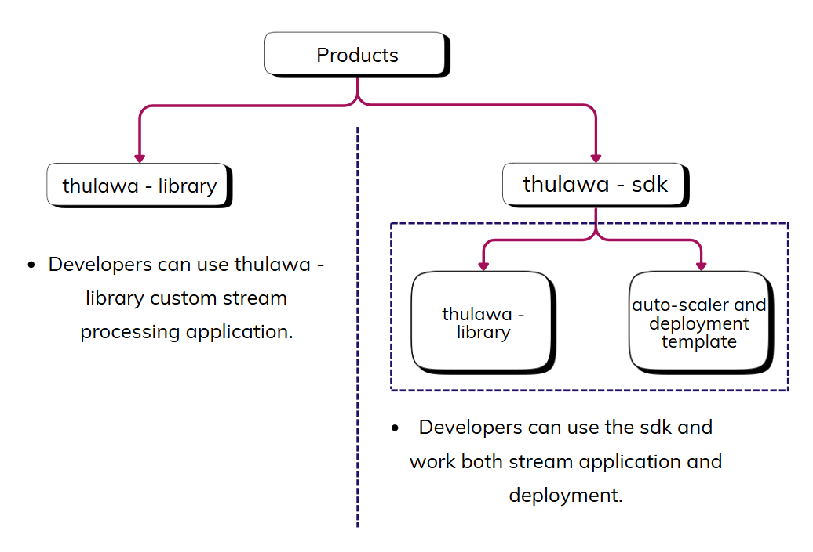

# Thulawa Kafka SDK

A high-performance, adaptive Kafka Streams extension that provides intelligent task scheduling, priority-based processing, and dynamic resource management for stream processing applications.

## 🛠️ Features

### 🚀 Core Capabilities

- Adaptive Scheduling: Intelligent task scheduling based on processing latency and queue metrics.
- Priority-based Processing: Configure high-priority keys for preferential processing.
- Micro-batching: Dynamic batch size optimization based on system performance.
- Thread Pool Management: Configurable thread pools with virtual thread support.
- Real-time Metrics: Comprehensive JVM and application metrics with Prometheus integration.
- Auto-scaling: Genetic algorithm-based Kubernetes auto-scaling.

### 📊 Monitoring & Observability
- JVM metrics (heap memory, CPU usage)
- Task processing metrics (throughput, latency)
- Queue-based metrics by key
- Prometheus integration
- Grafana dashboard support

### ☸️ Kubernetes Native
- Helm chart deployment
- Horizontal Pod Autoscaler (HPA)
- Prometheus monitoring
- Custom auto-scaler with genetic algorithms

## 🖼️ Product Overview


## 🏗️ Setup & Installation

```bash
# Clone the repository
git clone https://github.com/your-org/thulawa-kafka-sdk.git
cd thulawa-kafka-sdk

# Build the project
mvn clean install

# Run tests
mvn test

# Start local Kafka (if using Docker)
docker-compose -f docker-compose.dev.yml up -d
```

## 📝 License
This project is licensed under the Apache License 2.0 - see the LICENSE file for details.